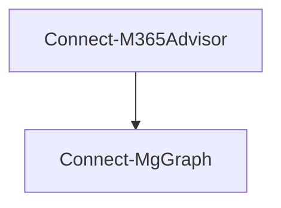

---
sidebar_label: Connect-M365Advisor
sidebar_position: 1
title: Connect-M365Advisor
---

# Connect-M365Advisor

## Overview

`Connect-M365Advisor` is a helper command that simplifies the process of authenticating to the services required to run M365Advisor tests including Microsoft Graph PowerShell, Azure PowerShell and Exchange Online PowerShell.

While `Connect-M365Advisor` will handle the most common interactive authentication scenarios, it does not replicate all of the authentication options available in the respective modules.

:::tip
The `Connect-M365Advisor` command is completely optional if your current PowerShell session is already connected to Microsoft Graph using Connect-MgGraph.
:::

Examining the code for `Connect-M365Advisor` will reveal that it simply calls `Connect-MgGraph`.



What this means is that you can use `Connect-MgGraph` directly if you prefer to have more control over the authentication process. See the [Connect-MgGraph: Microsoft Graph authentication](https://learn.microsoft.com/en-us/powershell/microsoftgraph/authentication-commands) documentation for more information on all the options available including the use of certificates, secrets, managed identities, different clouds and more.

## Using Connect-M365Advisor

### Connect to Microsoft Graph

To connect to Microsoft Graph, use the following command:

```powershell
Connect-M365Advisor
```

Running `Connect-M365Advisor` is the same as running the following:

```powershell
Connect-MgGraph -Scopes (Get-MtGraphScope)
```

#### Send Mail and Teams message

Connects to Microsoft Graph with the Mail.Send scope in addition to the default M365Advisor scopes. This allows you to use the required permission to send email when using the `Send-MtMail` command or when using `Invoke-M365Advisor -MailRecipient john@contoso.com`

```powershell
Connect-M365Advisor -SendMail
```

This is the same as running

```powershell
Connect-MgGraph -Scopes (Get-MtGraphScope -SendMail)
```

The same applies to the `-SendTeamsMessage` in `Connect-M365Advisor`.

#### Privileged scope

M365Advisor is designed to require read-only access to a tenant to run tests.

However, certain tests like [Test-MtExoMoeraMailActivity](../commands/Test-MtExoMoeraMailActivity.mdx) require privileged permission scopes to call certain APIs. If the permission is not granted, the specific test will be skipped.

Connecting with privileged scopes is optional. To connect with privileged scopes, use the `-Privileged` switch:

```powershell
Connect-M365Advisor -Privileged
```

#### Device code

The `-DeviceCode` switch allows you to sign in using the device code flow. This will open a browser window to prompt for authentication and is useful on Windows when you want to avoid single signing on as the current user.

```powershell
Connect-M365Advisor -UseDeviceCode
```

### Connect to SharePoint Online (optional)

M365Advisor includes SharePoint Online security tests that use the [PnP PowerShell](https://pnp.github.io/powershell/) module.

Install the PnP PowerShell module if you haven't already:

```powershell
Install-Module PnP.PowerShell -Scope CurrentUser
```

A dedicated Entra ID app registration configured for PnP interactive login is required. See [Grant permissions to SharePoint Online](../sections/create-entra-app.md) for how to create or reuse one.


Connect to SharePoint Online together with Microsoft Graph (the admin URL is auto-discovered from your tenant's initial domain):

```powershell
Connect-M365Advisor -Service Graph,SharePointOnline -SharePointClientId '<Client ID>'
```

If auto-discovery does not work (e.g. in government or custom-domain tenants), supply the admin URL explicitly:

```powershell
Connect-M365Advisor -Service Graph,SharePointOnline -SharePointClientId '<Client ID>' -SharePointAdminUrl 'https://contoso-admin.sharepoint.com'
```

If the PnP PowerShell module is not installed or there is no active connection, all SharePoint Online tests are skipped automatically.

### Connect to Azure, Exchange Online, Copilot Studio and Teams

`Connect-M365Advisor` also provides options to connect to Azure, Copilot Studio (via the Dataverse API), Exchange Online and Teams for running tests that use the Azure PowerShell, Dataverse OData API, Exchange Online PowerShell or Teams PowerShell modules.

The `-All` switch can be used to connect to all the services used by the M365Advisor tests. This includes Microsoft Graph, Azure, Copilot Studio (Dataverse), Exchange Online, Security Compliance, Microsoft Teams, and SharePoint Online.

If `-SharePointClientId` is not provided, the SharePoint Online connection is skipped with a warning.

```powershell
Connect-M365Advisor -Service All
```

If you need to connect to just a subset of the services you can specifiy them using the `-Service` parameter.

```powershell
Connect-M365Advisor -Service Azure,Graph,Teams
```

### Connect to Copilot Studio (via Dataverse)

To run the Copilot Studio Security Tests (MT.1113–MT.1122), connect with the `Dataverse` service:

```powershell
Connect-M365Advisor -Service Graph,Dataverse
```

This uses `Az.Accounts` to authenticate and obtain a Dataverse access token for the Copilot Studio environment configured in `m365advisor-config.json`.

### Connect to Azure DevOps (optional)

M365Advisor includes an *optional* set of Azure DevOps security tests (AZDO.*).
These tests require the community [`ADOPS`](https://www.powershellgallery.com/packages/ADOPS) PowerShell module and an active connection to your Azure DevOps organization.

Connecting to Azure DevOps is **not** part of `Connect-M365Advisor` and must be done separately:

```powershell
Install-Module ADOPS -Scope CurrentUser
Connect-ADOPS -Organization <your-organization>
```

If the `ADOPS` module is not installed or there is no active connection, the Azure DevOps tests are skipped automatically.

See the [installation guide](../installation.md#installing-azure-devops-powershell-module) for prerequisites and permissions, and the [Azure DevOps tests for M365Advisor](/blog/azuredevops-tests-for-m365advisor) blog post for the full list of available tests.

### Connect to US Government, US DoD, China and Germany and other clouds

`Connect-M365Advisor` also provides options to connect to the US Government, China and Germany clouds for Microsoft Graph, Azure and Exchange Online.

#### US Government

```powershell
Connect-M365Advisor -Environment USGov -AzureEnvironment AzureUSGovernment -ExchangeEnvironmentName O365USGovGCCHigh
```

#### US Department of Defense (DoD)

```powershell
Connect-M365Advisor -Environment USGovDoD -AzureEnvironment AzureUSGovernment -ExchangeEnvironmentName O365USGovDoD
```

#### China

```powershell
Connect-M365Advisor -Environment China -AzureEnvironment AzureChinaCloud -ExchangeEnvironmentName O365China
```

#### Germany

```powershell
Connect-M365Advisor -Environment Germany
```

### Connect using a custom application

You can use `Connect-M365Advisor` to connect to Microsoft Graph using a custom application by specifying the `-GraphClientId` parameter. This is useful if you wish to use a custom application for M365Advisor instead of using the default Graph PowerShell application.

```powershell
Connect-M365Advisor -GraphClientId 'f45ec3ad-32f0-4c06-8b69-47682afe0216'
```

To learn more about how to create a custom application for Microsoft Graph PowerShell see [Use delegated access with a custom application for Microsoft Graph PowerShell](https://learn.microsoft.com/en-us/powershell/microsoftgraph/authentication-commands?view=graph-powershell-1.0#use-delegated-access-with-a-custom-application-for-microsoft-graph-powershell).

