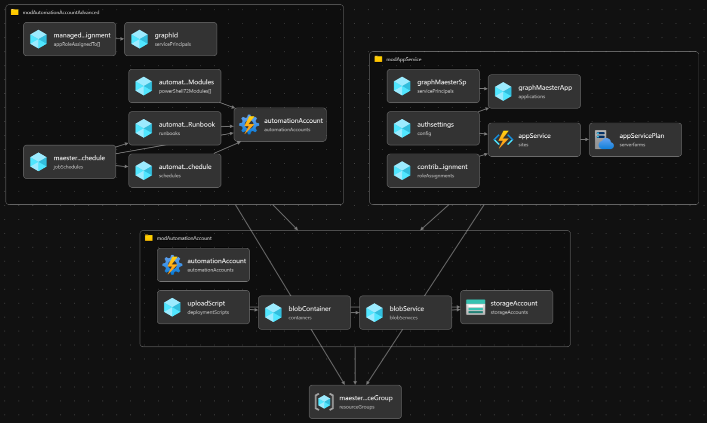
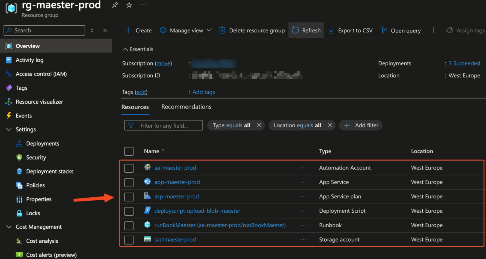
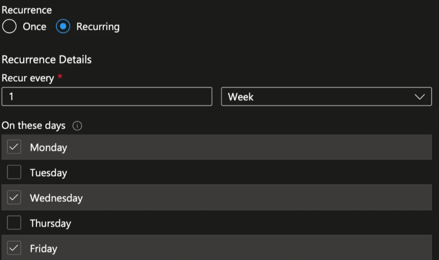
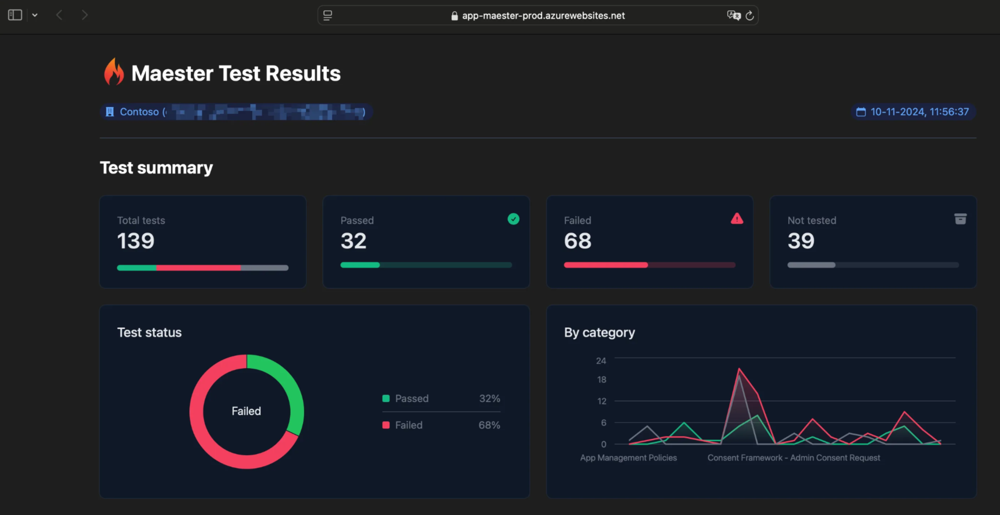

---
sidebar_label: Azure Web App with Bicep
sidebar_position: 8
title: Azure Web App
---
import GraphPermissions from '../sections/permissions.md';
import PrivilegedPermissions from '../sections/privilegedPermissions.md';

# <IIcon icon="devicon:azure" height="48" /> Setup M365Advisor in Azure Web App using Azure Bicep

This guide will demonstrate how to get M365Advisor running on an Azure Web App and provide an Azure Bicep template for automated deployment
-  This setup will allow you to perform security configuration checks on your Microsoft tenant by accessing the Azure Web App, which is protected with Entra ID Authentication through the Bicep deployment.🔥

## Why Azure Web App & Azure Automation & Azure Bicep?

Azure Web Apps provide the functionality to host your own websites. By running M365Advisor in an interactive web app, you can easily check the security recommendations for your organization. Azure Automation generates a new M365Advisor report every Monday, Wednesday, and Friday, which is then uploaded to the Azure Web App using Managed Identities.

 Azure Bicep is a domain-specific language that uses declarative syntax to deploy Azure resources. It simplifies the process of defining, deploying, and managing Azure resources. Here’s why Azure Bicep stands out:
- **Simplified Syntax**: Bicep provides concise syntax, reliable type safety, and support for reusing code.easier to read.
- **Support for all resource types and API versions**: Bicep immediately supports all preview and GA versions for Azure services.
- **Modular and Reusable**: Bicep enables the creation of modular templates that can be reused across various projects, ensuring consistency and minimizing duplication.



### Pre-requisites

- If this is your first time using Microsoft Azure, you must set up an [Azure Subscription](https://learn.microsoft.com/azure/cost-management-billing/manage/create-subscription) so you can create resources and are billed appropriately.
- You must have the **Global Administrator** role in your Entra tenant. This is so the necessary permissions can be consented to the Managed Identity.
- You must also have Azure Bicep & Azure CLI installed on your machine, this can be easily done with, using the following commands:

```PowerShell
winget install -e --id Microsoft.AzureCLI
winget install -e --id Microsoft.Bicep
```

## Template Walkthrough
This section will guide you through the templates required to deploy M365Advisor on Azure Automation Accounts. Depending on your needs, this can be done locally or through CI/CD pipelines.
- For instance, using your favorite IDE such as VS Code.
- Alternatively, through Azure DevOps.

To be able to declare Microsoft Graph resources in a Bicep file, you need to enable the Bicep Microsoft Graph extension by configuring ```bicepconfig.json```

```json
{
    "extensions": {
      "microsoftGraphV1": "br:mcr.microsoft.com/bicep/extensions/microsoftgraph/v1.0:1.0.0"
    }
  }
```

The ```main.bicepparam``` template defines our input parameters, such as the environment, customer, location, and app roles for the Managed Identity (MI).

```bicep
using 'main.bicep'

// Defing our input parameters
param __env__ = 'prod'
param __cust__ = 'ct'
param __location__ = 'westeurope'
param __defaultTenantName__ = 'contoso.onmicrosoft.com'

param __m365advisorAppRoles__ = [
  'DeviceManagementConfiguration.Read.All'
  'DeviceManagementManagedDevices.Read.All'
  'Directory.Read.All'
  'DirectoryRecommendations.Read.All'
  'IdentityRiskEvent.Read.All'
  'Policy.Read.All'
  'Policy.Read.ConditionalAccess'
  'PrivilegedAccess.Read.AzureAD'
  'Reports.Read.All'
  'RoleEligibilitySchedule.Read.Directory'
  'RoleManagement.Read.All'
  'SecurityIdentitiesSensors.Read.All'
  'SecurityIdentitiesHealth.Read.All'
  'SharePointTenantSettings.Read.All'
  'ThreatHunting.Read.All'
  'UserAuthenticationMethod.Read.All'
]

param __m365advisorAutomationAccountModules__ = [
  {
    name: 'M365Advisor'
    uri: 'https://www.powershellgallery.com/api/v2/package/M365Advisor'
    version: '1.3.0'
  }
  {
    name: 'Microsoft.Graph.Authentication'
    uri: 'https://www.powershellgallery.com/api/v2/package/Microsoft.Graph.Authentication'
    version: '2.30.0'
  }
  {
    name: 'Pester'
    uri: 'https://www.powershellgallery.com/api/v2/package/Pester'
    version: '5.7.1'
  }
  {
    name: 'NuGet'
    uri: 'https://www.powershellgallery.com/api/v2/package/NuGet'
    version: '1.3.3'
  }
  {
    name: 'PackageManagement'
    uri: 'https://www.powershellgallery.com/api/v2/package/PackageManagement'
    version: '1.4.8.1'
  }
  {
    name: 'ExchangeOnlineManagement'
    uri: 'https://www.powershellgallery.com/api/v2/package/ExchangeOnlineManagement'
    version: '3.9.0'
  }
  {
    name: 'MicrosoftTeams'
    uri: 'https://www.powershellgallery.com/api/v2/package/MicrosoftTeams'
    version: '7.3.1'
  }
]
```

The ```main.bicep``` template serves as the entry point for our Bicep configuration. It defines the parameters and variables used across the various modules.

```bicep
metadata name = 'M365Advisor Automation as Code <3'
metadata description = 'Deploys M365Advisor Automation Account with modules and runbook for automated reports on Mon, Wed, Fri via Azure Web App with Entra ID Auth'
metadata owner = 'M365Advisor'
targetScope = 'subscription'

extension microsoftGraphV1

@description('Defing our input parameters')
param __env__ string
param __cust__ string
param __location__ string
param __defaultTenantName__ string
param __m365advisorAppRoles__ array
param __m365advisorAutomationAccountModules__ array

@description('Defining our variables')
var _m365advisorAutomationVariables_ = [
  {
    name: 'appName'
    value: format('"{0}"', _appServiceName_)
    isEncrypted: false
  }
  {
    name: 'resourceGroupName'
    value: format('"{0}"', _m365advisorResourceGroupName_)
    isEncrypted: false
  }
  {
    name: 'tenantId'
    value: format('"{0}"', tenant().tenantId)
    isEncrypted: false
  }
  {
    name: 'tenant'
    value: format('"{0}"', __defaultTenantName__)
    isEncrypted: false
  }
  {
    name: 'enableTeamsTests'
    value: 'false'
    isEncrypted: false
  }
  {
    name: 'enableExchangeTests'
    value: 'false'
    isEncrypted: false
  }
  {
    name: 'enableComplianceTests'
    value: 'false'
    isEncrypted: false
  }
]

var _shortLocation_ = substring(__location__, 0, 6)
var _m365advisorResourceGroupName_ = 'rg-m365advisor-${__env__}-${_shortLocation_}-001'
var _m365advisorAutomationAccountName_ = 'aa-m365advisor-${__env__}-${_shortLocation_}-001'
var _suffix_ = substring(uniqueString(subscription().id), 0, 2)
var _m365advisorStorageAccountName_ = 'sa${__cust__}${_suffix_}${__env__}001'
var _m365advisorStorageBlobName_ = 'm365advisor'
var _m365advisorStorageBlobFileName_ = 'm365advisor.ps1'
var _appServiceName_ = 'app-m365advisor-${_suffix_}-${__env__}-${_shortLocation_}-001'
var _appServicePlanName_ = 'asp-m365advisor-${__env__}-${_shortLocation_}-001'

@description('Resource Group Deployment')
resource m365advisorResourceGroup 'Microsoft.Resources/resourceGroups@2023-07-01' = {
  name: _m365advisorResourceGroupName_
  location: __location__
}

@description('Module Deployment')
module modAutomationAccount './modules/aa.bicep' = {
  name: 'module-automation-account-deployment'
  params: {
    __location__: __location__
    _m365advisorAutomationVariables_: _m365advisorAutomationVariables_
    _appServiceName_: _appServiceName_
    _m365advisorResourceGroupName_: _m365advisorResourceGroupName_
    _m365advisorAutomationAccountName_: _m365advisorAutomationAccountName_
    __m365advisorAutomationAccountModules__: __m365advisorAutomationAccountModules__
    _m365advisorStorageAccountName_: _m365advisorStorageAccountName_
    _m365advisorStorageBlobName_: _m365advisorStorageBlobName_
    _m365advisorStorageBlobFileName_: _m365advisorStorageBlobFileName_
  }
  scope: m365advisorResourceGroup
}

module modAutomationAccountAdvanced './modules/aa-advanced.bicep' = {
  name: 'module-automation-account-advanced-deployment'
  params: {
    __location__: __location__
    __ouM365AdvisorAutomationMiId__: modAutomationAccount.outputs.__ouM365AdvisorAutomationMiId__
    __ouM365AdvisorScriptBlobUri__: modAutomationAccount.outputs.__ouM365AdvisorScriptBlobUri__
    _m365advisorAutomationAccountName_: _m365advisorAutomationAccountName_
    __m365advisorAppRoles__:  __m365advisorAppRoles__

  }
  scope: m365advisorResourceGroup
}

module modAppService './modules/app-service.bicep' = {
  name: 'module-app-service-deployment'
  params: {
    __location__: __location__
    __ouM365AdvisorAutomationMiId__: modAutomationAccount.outputs.__ouM365AdvisorAutomationMiId__
    _appServiceName_: _appServiceName_
    _appServicePlanName_: _appServicePlanName_
  }
  scope: m365advisorResourceGroup
}
```

The ```aa.bicep``` module-file, automates the deployment of the M365Advisor Azure Automation Account, a Storage Account, a container and uploads the M365Advisor script to the Blob Container, which will be later used as input for our PowerShell runbook for the automation account to generate a security report.

```bicep

param __location__ string
param _m365advisorAutomationVariables_ array
param _appServiceName_ string
param _m365advisorResourceGroupName_ string
param _m365advisorAutomationAccountName_ string
param __m365advisorAutomationAccountModules__ array
param _m365advisorStorageAccountName_ string
param _m365advisorStorageBlobName_ string
param _m365advisorStorageBlobFileName_ string

@description('Automation Account Deployment')
resource automationAccount 'Microsoft.Automation/automationAccounts@2024-10-23' = {
  name: _m365advisorAutomationAccountName_
  location: __location__
  identity: {
    type: 'SystemAssigned'
  }
  properties: {
    sku: {
      name: 'Basic'
    }
  }
}

@description('Create Automation Variables')
resource variables 'Microsoft.Automation/automationAccounts/variables@2023-11-01' = [for var in _m365advisorAutomationVariables_: {
  parent: automationAccount
  name: var.name
  properties: {
    value: var.value
    isEncrypted: var.isEncrypted
  }
}]

resource automationAccountRuntimeEnvironment 'Microsoft.Automation/automationAccounts/runtimeEnvironments@2024-10-23' = {
  parent: automationAccount
  name: 'PowerShell-7.4'
  location: __location__
  properties: {
    runtime: {
      language: 'PowerShell'
      version: '7.4'
    }
    defaultPackages: {
       az: '12.3.0'
       'Azure CLI': '2.64.0' 
    }
  }
}

resource rtePackages 'Microsoft.Automation/automationAccounts/runtimeEnvironments/packages@2024-10-23' = [
  for m in __m365advisorAutomationAccountModules__: {
    name: m.name
    parent: automationAccountRuntimeEnvironment
    properties: {
      contentLink: {
        uri: m.uri
        version: m.version
      }
    }
  }
]
resource storageAccount 'Microsoft.Storage/storageAccounts@2025-01-01' = {
  name: _m365advisorStorageAccountName_
  location: __location__
  sku: {
    name: 'Standard_LRS'
  }
  kind: 'StorageV2'
  properties: {
    accessTier: 'Hot'
    allowBlobPublicAccess: true
    networkAcls: {
      defaultAction: 'Allow'
    }
  }

}

@description('Create Blob Service')
resource blobService 'Microsoft.Storage/storageAccounts/blobServices@2025-01-01' = {
  parent: storageAccount
  name: 'default'
}

@description('Create Blob Container')
resource blobContainer 'Microsoft.Storage/storageAccounts/blobServices/containers@2025-01-01' = {
  parent: blobService
  name: _m365advisorStorageBlobName_
  properties: {
    publicAccess: 'Blob'
  }
}

@description('Upload .ps1 file to Blob Container using Deployment Script')
resource uploadScript 'Microsoft.Resources/deploymentScripts@2023-08-01' = {
  name: 'deployscript-upload-blob-m365advisor'
  location: __location__
  kind: 'AzureCLI'
  properties: {
    azCliVersion: '2.26.1'
    timeout: 'PT5M'
    retentionInterval: 'PT1H'
    environmentVariables: [
      {
        name: 'AZURE_STORAGE_ACCOUNT'
        value: storageAccount.name
      }
      {
        name: 'AZURE_STORAGE_KEY'
        secureValue: storageAccount.listKeys().keys[0].value
      }
      {
        name: 'CONTENT'
        value: loadTextContent('../pwsh/m365advisor.ps1')
      }
    ]
    arguments: '-appName ${_appServiceName_} -rgName ${_m365advisorResourceGroupName_}'
    scriptContent: 'echo "$CONTENT" > ${_m365advisorStorageBlobFileName_} && az storage blob upload -f ${_m365advisorStorageBlobFileName_} -c ${_m365advisorStorageBlobName_} -n ${_m365advisorStorageBlobFileName_}'
  }
  dependsOn: [
    blobContainer
  ]
}

@description('Outputs')
output __ouM365AdvisorAutomationMiId__ string = automationAccount.identity.principalId
output __ouM365AdvisorScriptBlobUri__ string = 'https://${_m365advisorStorageAccountName_}.blob.${environment().suffixes.storage}/${_m365advisorStorageBlobName_}/m365advisor.ps1'
```

The ```aa-advanced.bicep``` module file automates the configuration of the M365Advisor Azure Automation Account by setting up role assignments, installing necessary PowerShell modules, creating a runbook, defining a schedule, and associating the runbook with the schedule. This configuration enables M365Advisor to run automatically in Azure according to the specified schedule. This module is separate due to the need for replicating the Managed Service Identity (MSI) in Entra ID. By dividing the configuration into two module files, we can add the API consents 💪🏻


```bicep
extension microsoftGraphV1
param __location__ string
param __m365advisorAppRoles__ array

param __ouM365AdvisorAutomationMiId__ string
param __ouM365AdvisorScriptBlobUri__ string
param _m365advisorAutomationAccountName_ string
param __currentUtcTime__ string = utcNow()

@description('Microsoft Graph - Role Assignment Deployment')
resource graphId 'Microsoft.Graph/servicePrincipals@v1.0' existing = {
  appId: '00000003-0000-0000-c000-000000000000'
}

@description('Exchange - Role Assignment Deployment')
resource exchangeOnlineId 'Microsoft.Graph/servicePrincipals@v1.0' existing =  {
  appId: '00000002-0000-0ff1-ce00-000000000000'
}

resource managedIdentityRoleAssignment 'Microsoft.Graph/appRoleAssignedTo@v1.0' = [for appRole in __m365advisorAppRoles__: {
    appRoleId: (filter(graphId.appRoles, role => role.value == appRole)[0]).id
    principalId: __ouM365AdvisorAutomationMiId__
    resourceId: graphId.id
}]

resource managedIdentityRoleAssignmentExchange 'Microsoft.Graph/appRoleAssignedTo@v1.0' =  {
  appRoleId: (filter(exchangeOnlineId.appRoles, role => role.value == 'Exchange.ManageAsApp')[0]).id
  principalId: __ouM365AdvisorAutomationMiId__
  resourceId: exchangeOnlineId.id
}

@description('Existing Automation Account')
resource automationAccount 'Microsoft.Automation/automationAccounts@2024-10-23' existing = {
  name: _m365advisorAutomationAccountName_
}

@description('Runbook Deployment')
resource automationAccountRunbook 'Microsoft.Automation/automationAccounts/runbooks@2024-10-23' = {
  name: 'runBookM365Advisor'
  location: __location__
  parent: automationAccount
  properties: {
    runbookType: 'PowerShell'
    runtimeEnvironment: 'PowerShell-7.4'
    logProgress: true
    logVerbose: true
    description: 'Runbook to execute M365Advisor report'
    publishContentLink: {
      uri: __ouM365AdvisorScriptBlobUri__
    }
  }
}

@description('Schedule Deployment')
resource automationAccountSchedule 'Microsoft.Automation/automationAccounts/schedules@2024-10-23' = {
  name: 'scheduleM365Advisor'
  parent: automationAccount
  properties: {
    advancedSchedule: {
      weekDays:[
        'Monday'
        'Wednesday'
        'Friday'
      ]
    }
    expiryTime: '9999-12-31T23:59:59.9999999+00:00'
    frequency: 'Week'
    interval: 1
    startTime: dateTimeAdd(__currentUtcTime__, 'PT1H')
    timeZone: 'W. Europe Standard Time'
  }
}

@description('Runbook Schedule Association')
resource m365advisorRunbookSchedule 'Microsoft.Automation/automationAccounts/jobSchedules@2024-10-23' = {
  name: guid(automationAccount.id, automationAccountRunbook.name, automationAccount.name)
  parent: automationAccount
  properties: {
    parameters: {}
    runbook: {
      name: automationAccountRunbook.name
    }
    schedule: {
      name: automationAccountSchedule.name
    }
  }
}
```

The ```app-service.bicep``` module-file automates deployment of an Azure App Service with an associated App Service Plan and configures Entra ID authentication. It ensures that the App Service can authenticate users via Entra ID and access Microsoft Graph API with the ```User.Read``` permissions.

```bicep
param __location__ string
param _appServiceName_ string
param _appServicePlanName_ string
param __ouM365AdvisorAutomationMiId__ string
extension microsoftGraphV1

@description('Role Assignments Deployment')
resource contributorRoleAssignment 'Microsoft.Authorization/roleAssignments@2022-04-01' = {
  scope: appService
  name: guid(appService.id)
  properties: {
    roleDefinitionId: subscriptionResourceId('Microsoft.Authorization/roleDefinitions', 'b24988ac-6180-42a0-ab88-20f7382dd24c') // Contributor role ID
    principalId: __ouM365AdvisorAutomationMiId__
  }
}

resource appServicePlan 'Microsoft.Web/serverfarms@2024-11-01' = {
  name: _appServicePlanName_
  location: __location__
  sku: {
    name: 'B1'
    tier: 'Basic'
  }
}

resource graphM365AdvisorApp 'Microsoft.Graph/applications@v1.0' = {
  uniqueName: 'idp-${_appServiceName_}'
  signInAudience: 'AzureADMyOrg'
  displayName: 'idp-${_appServiceName_}'
  web: {
    redirectUris: [
      'https://${_appServiceName_}.azurewebsites.net/.auth/login/aad/callback'
    ]
    implicitGrantSettings: {
      enableIdTokenIssuance: true
      enableAccessTokenIssuance: false
    }
  }
  requiredResourceAccess: [
    {
      resourceAppId: '00000003-0000-0000-c000-000000000000' // Microsoft Graph
      resourceAccess: [
        {
          id: 'e1fe6dd8-ba31-4d61-89e7-88639da4683d' // User.Read
          type: 'Scope'
        }
      ]
    }
  ]
}

resource graphM365AdvisorSp 'Microsoft.Graph/servicePrincipals@v1.0' = {
  appId: graphM365AdvisorApp.appId
}

resource appService 'Microsoft.Web/sites@2024-11-01' = {
  name: _appServiceName_
  location: __location__
  identity: {
    type: 'SystemAssigned'
  }
  properties: {
    serverFarmId: appServicePlan.id
    siteConfig: {
      appSettings: [
        {
          name: 'WEBSITE_RUN_FROM_PACKAGE'
          value: '1'
        }
      ]
    }
  }
}

resource authsettings 'Microsoft.Web/sites/config@2024-11-01' = {
 parent: appService
 name: 'authsettingsV2'
  properties: {
    globalValidation: {
      redirectToProvider: 'Microsoft'
      requireAuthentication: true
      unauthenticatedClientAction: 'RedirectToLoginPage'
    }
    identityProviders: {
      azureActiveDirectory: {
        enabled: true
        registration: {
          clientId: graphM365AdvisorApp.appId
          openIdIssuer: 'https://sts.windows.net/${subscription().tenantId}/v2.0'
          clientSecretSettingName: 'MICROSOFT_PROVIDER_AUTHENTICATION_SECRET'
        }
        validation: {
          jwtClaimChecks: {}
          allowedAudiences: [
            'api://${graphM365AdvisorApp.appId}'
          ]
        }
      }
    }
  }
}
```

The PowerShell script has been updated to generate an HTML report, which is then zipped. This package is uploaded to the Azure Web App and published using the Managed Identity of the Automation Account, which has RBAC assignment on the Azure Web App. Save the file in the folder `pwsh` with the name `m365advisor.ps1`
```PowerShell
#Retrieve the default automation account variables
$appName           = Get-AutomationVariable -Name 'appName'
$resourceGroupName = Get-AutomationVariable -Name 'resourceGroupName'
$TenantId          = Get-AutomationVariable -Name 'tenantId'
$Tenant            = Get-AutomationVariable -Name 'tenant'

#Retrieve the test options
$enableTeamsTests     = [System.Convert]::ToBoolean((Get-AutomationVariable -Name 'enableTeamsTests'))
$enableExchangeTests  = [System.Convert]::ToBoolean((Get-AutomationVariable -Name 'enableExchangeTests'))
$enableComplianceTests = [System.Convert]::ToBoolean((Get-AutomationVariable -Name 'enableComplianceTests'))

#Setting up the connections
Connect-MgGraph -Identity
Connect-AzAccount -Identity

if ($enableExchangeTests) {
    Connect-ExchangeOnline -ManagedIdentity -Organization $Tenant -ShowBanner:$false
}

if ($enableComplianceTests) {
    $scToken = Get-AzAccessToken -ResourceUrl "https://ps.compliance.protection.outlook.com/"
    Connect-IPPSSession -AccessToken $scToken.Token -Organization $Tenant
}

if ($enableTeamsTests) {
    Connect-MicrosoftTeams -Identity
}

#Output folder and M365Advisor
$date = (Get-Date).ToString("yyyyMMdd-HHmm")
$FileName = "M365AdvisorReport$($date).zip"
$TempOutputFolder = Join-Path $env:TEMP $date
if (!(Test-Path $TempOutputFolder -PathType Container)) {
    New-Item -ItemType Directory -Force -Path $TempOutputFolder | Out-Null
}

Set-Location $env:TEMP
if (!(Test-Path ".\m365advisor-tests")) { New-Item -ItemType Directory -Path ".\m365advisor-tests" | Out-Null }
Set-Location ".\m365advisor-tests"

Install-M365AdvisorTests .\tests
Invoke-M365Advisor -OutputHtmlFile (Join-Path $TempOutputFolder "index.html")

Compress-Archive -Path (Join-Path $TempOutputFolder "*") -DestinationPath $FileName -Force

#Deploy to Azure Web App
Connect-AzAccount -Identity
Publish-AzWebApp -ResourceGroupName $resourceGroupName -Name $appName -ArchivePath $FileName -Force
```


## Deployment

- You have the flexibility to deploy either based on deployment stacks or directly to the Azure Subscription.
- Using Deployment Stacks allows you to bundle solutions into a single package, offering several advantages
  - Management of resources across different scopes as a single unit
  - Securing resources with deny settings to prevent configuration drift
  - Easy cleanup of development environments by deleting the entire stack


Directly deployed based:
```PowerShell
#Connect to Azure
Connect-AzAccount

#Getting current context to confirm we deploy towards right Azure Subscription
Get-AzContext

# If not correct context, change, using:
# Get-AzSubscription
# Set-AzContext -SubscriptionID "ID"

#Deploy to Azure Subscription
New-AzSubscriptionDeployment -Name M365Advisor -Location WestEurope -TemplateFile .\main.bicep -TemplateParameterFile .\main.bicepparam
```

Deployment Stack based:
```PowerShell
#Connect to Azure
Connect-AzAccount

#Getting current context to confirm we deploy towards right Azure Subscription
Get-AzContext

# If not correct context, change, using:
# Get-AzSubscription
# Set-AzContext -SubscriptionID "ID"

#Change DenySettingsMode and ActionOnUnmanage based on your needs..
New-AzSubscriptionDeploymentStack -Name M365Advisor -Location WestEurope -DenySettingsMode None -ActionOnUnmanage DetachAll -TemplateFile .\main.bicep -TemplateParameterFile .\main.bicepparam
```
## Exchange Online and Security and Compliance access
To grant the system-assigned managed identity of the Azure Automation Account access to Exchange Online and Security & Compliance, run the PowerShell script below since this cannot be done through the portal. Update the organization variable to match your environment before running the script. This step only needs to be performed once and ensures the managed identity has the least privilege required to check your Exchange, Security and Compliance settings by assigning the View-Only Recipients role.

```PowerShell
# Managed Identity displayName
$managedIdentityDisplayName = 'aa-m365advisor-prod-westeu-001'

# Exchange Online
$roleName = 'View-Only Recipients'
$organization = 'tenantName.onmicrosoft.com'

Connect-AzAccount -DeviceCode
$entraSp = Get-AzADServicePrincipal -Filter "displayName eq '$managedIdentityDisplayName'"
if(-not $entraSp){ throw "No servicePrincipal found with displayName $managedIdentityDisplayName" }

#===============================
# Exchange Online
#===============================
Connect-ExchangeOnline -Organization $organization

# Creates the Service Principal object in Exchange Online
New-ServicePrincipal -AppId $entraSp.AppId -ObjectId $entraSp.Id -DisplayName $entraSp.DisplayName

# Assigns the 'View-Only Configuration' role to the Managed Identity
New-ManagementRoleAssignment -Role $roleName -App $entraSp.DisplayName

#===============================
# Purview Security and Compliance
#===============================

Connect-IPPSSession -Organization $organization

# Creates the Service Principal object in Exchange Online
New-ServicePrincipal -AppId $entraSp.AppId -ObjectId $entraSp.Id -DisplayName $entraSp.DisplayName

# Assigns the 'View-Only Configuration' role to the Managed Identity
New-ManagementRoleAssignment -Role $roleName -App $entraSp.DisplayName
```

## Microsoft Teams access

To grant the system-assigned managed identity of the Azure Automation Account access to Microsoft Teams, assign the identity to the Teams Administrator role.

## Viewing the Azure Resources
We can see the resources located in the resource group called ```rg-m365advisor-prod-westeu-001```.



The schedule of the Automation Account which will trigger on Monday, Wednesday, and Friday to upload new M365Advisor report to the Azure Web App. You can easily adjust the schedule to suit your needs:


## Viewing the Azure Web App



## FAQ / Troubleshooting

- Ensure you have the latest version of Azure Bicep, as the ```microsoftGraphV1_0``` module depends on the newer versions

## Contributors

- Original author: [Brian Veldman](https://www.linkedin.com/in/brian-veldman/) | Microsoft MVP

