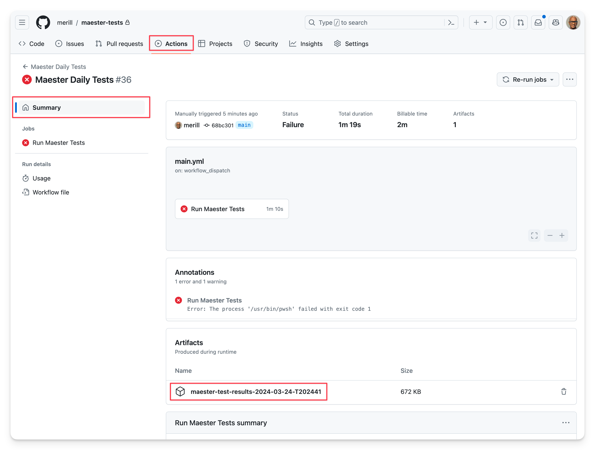
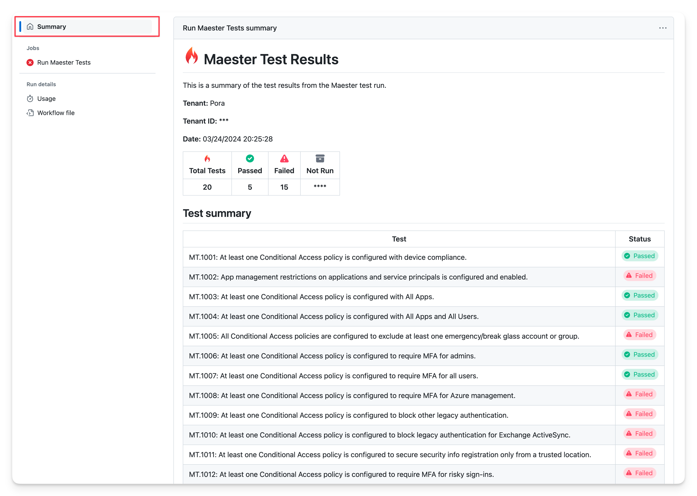
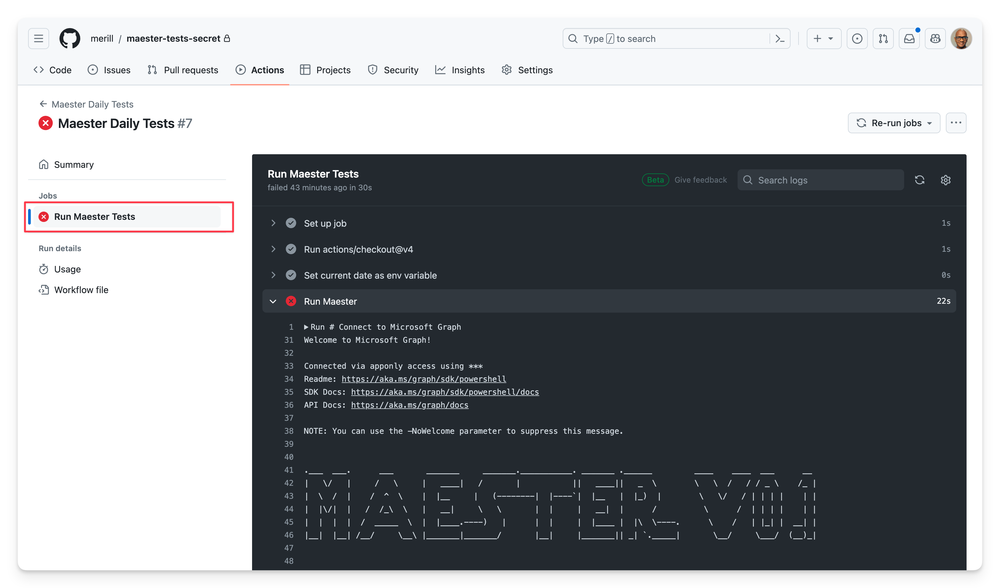

---
sidebar_label: GitHub
sidebar_position: 2
title: Set up M365Advisor in GitHub
---

import Tabs from '@theme/Tabs';
import TabItem from '@theme/TabItem';
import GraphPermissions from '../sections/permissions.md';
import CreateEntraApp from '../sections/create-entra-app.md';
import CreateEntraClientSecret from '../sections/create-entra-client-secret.md';
import EnableGitHubActionsCreateWorkflow from '../sections/enable-github-actions-workflow.md';

# <IIcon icon="mdi:github" height="48" /> Set up M365Advisor in GitHub

This guide will walk you through setting up M365Advisor in GitHub and automate the running of tests using GitHub Actions.

## Why GitHub?

GitHub is the quickest and easiest way to get started with automating M365Advisor. The [free tier](https://github.com/pricing) includes 2,000 minutes per month for private repositories which is more than enough to run your M365Advisor tests daily.

## Set up your M365Advisor tests repository in GitHub

### Pre-requisites

- If you are new to GitHub, create an account at [github.com](https://github.com/join)

## Create a new GitHub repository

- Open [https://github.com/new](https://github.com/new)
- Fill in the following fields:
  - **Repository name**: E.g. `m365advisor-tests`
  - **Private**: Select this option to keep your tests private
- Select **Create repository**

## Set up the GitHub Actions workflow

There are many ways to authenticate with Microsoft Entra from GitHub Actions. We recommend using [**workload identity federation**](https://learn.microsoft.com/entra/workload-id/workload-identity-federation) as it is more secure, requires less maintenance and is the easiest to set up.

If you’re unable to use more advanced options like certificates stored in Azure Key Vault, which need an Azure subscription, there’s also guidance available for using client secrets.

- <IIcon icon="gravity-ui:nut-hex" height="18" /> **Workload identity federation** (recommended) uses OpenID Connect (OIDC) to authenticate with Microsoft Entra protected resources without using secrets.
- <IIcon icon="material-symbols:password" height="18" /> **Client secret** uses a secret to authenticate with Microsoft Entra protected resources.

<Tabs>
  <TabItem value="gha-wif" label="GitHub Action using Workload identity federation (recommended)" default>

This guide is based on [Use GitHub Actions to connect to Azure](https://learn.microsoft.com/azure/developer/github/connect-from-azure) and uses the m365advisor GitHub action.

:::tip PowerShell shortcut

If you have the `M365Advisor` PowerShell module and the [GitHub CLI](https://cli.github.com/) installed, the next four sections (create Entra app, grant permissions, add federated credentials, set GitHub secrets) can be completed in a single command from inside your `m365advisor-tests` clone:

```powershell
Connect-M365Advisor -Service Azure
New-MtM365AdvisorApp -GitHubActions -SetGitHubSecrets
```

The cmdlet auto-detects the GitHub repository from the local `git remote`, creates the application, grants all required Graph permissions, adds the federated credential, and pushes `AZURE_CLIENT_ID` / `AZURE_TENANT_ID` to the repo's Actions secrets via `gh`.

The portal-based steps below remain fully supported.

:::

### Pre-requisites Workload identity federation

<CreateEntraApp/>

### Add federated credentials

- Select **Certificates & secrets**
- Select **Federated credentials**, select **Add credential**
- For **Federated credential scenario**, select **GitHub Actions deploying Azure resources**
- Fill in the following fields
  - **Organization**: Your GitHub organization name or GitHub username. E.g. `jasonf`
  - **Repository**: Your GitHub repository name (from the previous step). E.g. `m365advisor-tests`
  - **Entity type**: `Branch`
  - **GitHub branch name**: `main`
  - **Credential details** > **Name**: E.g. `m365advisor-devops`
- Select **Add**

### Add Entra tenant info to GitHub repo

- Open your `m365advisor-tests` GitHub repository and go to **Settings**
- Select **Security** > **Secrets and variables** > **Actions**
- Add the secrets listed below by selecting **New repository secret**
- To look up these values you will need to use the Entra portal, open the application you created earlier and copy the following values from the **Overview** page:
  - Name: **AZURE_TENANT_ID**, Value: The Directory (tenant) ID of the Entra tenant
  - Name: **AZURE_CLIENT_ID**, Value: The Application (client) ID of the Entra application you created
- Save each secret by selecting **Add secret**.

<EnableGitHubActionsCreateWorkflow/>

```yaml
name: Run M365Advisor 🔥

on:
  push:
    branches:
      - main

  schedule:
    # Daily at 7:30 UTC, change accordingly
    - cron: "30 7 * * *"

  # Allows to run this workflow manually from the Actions tab
  workflow_dispatch:

jobs:
  test:
    runs-on: ubuntu-latest
    permissions:
      id-token: write
      contents: read

    steps:
      - name: Run M365Advisor 🔥
        id: m365advisor
        # Set the action version to a specific version, to keep using that exact version.
        uses: m365advisor365/m365advisor-action@main
        with:
          tenant_id: ${{ secrets.AZURE_TENANT_ID }}
          client_id: ${{ secrets.AZURE_CLIENT_ID }}
          include_public_tests: true
          include_private_tests: false
          include_exchange: false
          include_teams: false
          # Set a specific version of the powershell module here or 'latest' or 'preview'
          # check out https://www.powershellgallery.com/packages/M365Advisor/
          m365advisor_version: latest
          disable_telemetry: false
          step_summary: true

      - name: Write status 📃
        shell: bash
        run: |
          echo "The result of the test run is: ${{ steps.m365advisor.outputs.result }}"
          echo "Total tests: ${{ steps.m365advisor.outputs.tests_total }}"
          echo "Passed tests: ${{ steps.m365advisor.outputs.tests_passed }}"
          echo "Failed tests: ${{ steps.m365advisor.outputs.tests_failed }}"
          echo "Skipped tests: ${{ steps.m365advisor.outputs.tests_skipped }}"
```

  </TabItem>
  <TabItem value="wif" label="Custom workflow using Workload identity federation" default>

This guide is based on [Use GitHub Actions to connect to Azure](https://learn.microsoft.com/azure/developer/github/connect-from-azure)

### Pre-requisites

- An Azure subscription is required for this method. This Azure subscription is required to set up workload identity federation authentication. No Azure resources will be created and there are no costs associated with it.
  - If you don't have an Azure subscription, you can create one by following [Create a Microsoft Customer Agreement subscription](https://learn.microsoft.com/azure/cost-management-billing/manage/create-subscription) or ask your Azure administrator to create one.

<CreateEntraApp/>

### Add federated credentials

- Select **Certificates & secrets**
- Select **Federated credentials**, select **Add credential**
- For **Federated credential scenario**, select **GitHub Actions deploying Azure resources**
- Fill in the following fields
  - **Organization**: Your GitHub organization name or GitHub username. E.g. `jasonf`
  - **Repository**: Your GitHub repository name (from the previous step). E.g. `m365advisor-tests`
  - **Entity type**: `Branch`
  - **GitHub branch name**: `main`
  - **Credential details** > **Name**: E.g. `m365advisor-devops`
- Select **Add**

### Create GitHub secrets

- Open your `m365advisor-tests` GitHub repository and go to **Settings**
- Select **Security** > **Secrets and variables** > **Actions**
- Add the secrets listed below by selecting **New repository secret**
- To look up these values you will need to use the Entra portal, open the application you created earlier and copy the following values from the **Overview** page:
  - Name: **AZURE_TENANT_ID**, Value: The Directory (tenant) ID of the Entra tenant
  - Name: **AZURE_CLIENT_ID**, Value: The Application (client) ID of the Entra application you created
- Save each secret by selecting **Add secret**.

<EnableGitHubActionsCreateWorkflow/>

```yaml
name: M365Advisor Daily Tests

on:
  push:
    branches: ["main"]
  # Run once a day at midnight
  schedule:
    - cron: "0 0 * * *"
  # Allows to run this workflow manually from the Actions tab
  workflow_dispatch:

permissions:
      id-token: write
      contents: read
      checks: write

jobs:
  run-m365advisor-tests:
    name: Run M365Advisor Tests
    runs-on: ubuntu-latest
    steps:
    - uses: actions/checkout@v4
    - name: Set current date as env variable
      run: echo "NOW=$(date +'%Y-%m-%d-T%H%M%S')" >> $GITHUB_ENV
    - name: 'Az CLI login'
      uses: azure/login@v2
      with:
          tenant-id: ${{ secrets.AZURE_TENANT_ID }}
          client-id: ${{ secrets.AZURE_CLIENT_ID }}
          allow-no-subscriptions: true
    - name: Run M365Advisor
      uses: azure/powershell@v2
      with:
        inlineScript: |
          # Get Token
          $token = az account get-access-token --resource-type ms-graph

          # Connect to Microsoft Graph
          $accessToken = ($token | ConvertFrom-Json).accessToken | ConvertTo-SecureString -AsPlainText -Force
          Connect-MgGraph -AccessToken $accessToken

          # Install M365Advisor
          Install-Module M365Advisor -Force

          # Install Tests
          Install-M365AdvisorTests -Path ./tests

          # Configure test results
          $PesterConfiguration = New-PesterConfiguration
          $PesterConfiguration.Output.Verbosity = 'None'

          # Run M365Advisor tests
          $results = Invoke-M365Advisor -Path ./tests -PesterConfiguration $PesterConfiguration -OutputFolder test-results -OutputFolderFileName "test-results" -PassThru

          # Add step summary
          $summary = Get-Content test-results/test-results.md
          Add-Content -Path $env:GITHUB_STEP_SUMMARY -Value $summary

          # Flag status to GitHub - Uncomment the block below to fail the build if tests fail
          #if ($results.Result -ne 'Passed'){
          #  Write-Error "Status = $($results.Result): See M365Advisor Test Report below for details."
          #}
        azPSVersion: "latest"

    - name: Archive M365Advisor Html Report
      uses: actions/upload-artifact@v4
      if: always()
      with:
        name: m365advisor-test-results-${{ env.NOW }}
        path: test-results
```

  </TabItem>
  <TabItem value="cert" label="Custom workflow using Client secret">

<CreateEntraApp/>

<CreateEntraClientSecret/>

### Create GitHub secrets

- Open your `m365advisor-tests` GitHub repository and go to **Settings**
- Select **Security** > **Secrets and variables** > **Actions**
- Add the three secrets listed below by selecting **New repository secret**
- To look up these values you will need to use the Entra portal, open the application you created earlier and copy the following values from the **Overview** page:
  - Name: **AZURE_TENANT_ID**, Value: The Directory (tenant) ID of the Entra tenant
  - Name: **AZURE_CLIENT_ID**, Value: The Application (client) ID of the Entra application you created
  - Name: **AZURE_CLIENT_SECRET**, Value: The client secret you copied in the previous step
- Save each secret by selecting **Add secret**.

<EnableGitHubActionsCreateWorkflow/>

```yaml
name: M365Advisor Daily Tests

on:
  push:
    branches: ["main"]
  # Run once a day at midnight
  schedule:
    - cron: "0 0 * * *"
  # Allows to run this workflow manually from the Actions tab
  workflow_dispatch:

permissions:
      id-token: write
      contents: read
      checks: write

jobs:
  run-m365advisor-tests:
    name: Run M365Advisor Tests
    runs-on: ubuntu-latest
    steps:
    - uses: actions/checkout@v4
    - name: Set current date as env variable
      run: echo "NOW=$(date +'%Y-%m-%d-T%H%M%S')" >> $GITHUB_ENV
    - name: Run M365Advisor
      shell: pwsh
      env:
        TENANTID: ${{ secrets.AZURE_TENANT_ID }}
        CLIENTID: ${{ secrets.AZURE_CLIENT_ID }}
        CLIENTSECRET: ${{ secrets.AZURE_CLIENT_SECRET }}
      run: |
        # Connect to Microsoft Graph
        $clientSecret = ConvertTo-SecureString -AsPlainText $env:CLIENTSECRET -Force
        [pscredential]$clientSecretCredential = New-Object System.Management.Automation.PSCredential($env:CLIENTID, $clientSecret)
        Connect-MgGraph -TenantId $env:TENANTID -ClientSecretCredential $clientSecretCredential

        # Install M365Advisor
        Install-Module M365Advisor -Force

        # Install Tests
        Install-M365AdvisorTests -Path ./tests

        # Configure test results
        $PesterConfiguration = New-PesterConfiguration
        $PesterConfiguration.Output.Verbosity = 'None'

        # Run M365Advisor tests
        $results = Invoke-M365Advisor -Path ./tests/M365Advisor/ -PesterConfiguration $PesterConfiguration -OutputFolder test-results -OutputFolderFileName "test-results" -PassThru

        # Add step summary
        $summary = Get-Content test-results/test-results.md
        Add-Content -Path $env:GITHUB_STEP_SUMMARY -Value $summary

        # Flag status to GitHub - Uncomment the block below to fail the build if tests fail
        #if ($results.Result -ne 'Passed'){
        #  Write-Error "Status = $($results.Result): See M365Advisor Test Report below for details."
        #}

    - name: Archive M365Advisor Html Report
      uses: actions/upload-artifact@v4
      if: always()
      with:
        name: m365advisor-test-results-${{ env.NOW }}
        path: test-results
```

### Step-by-step video tutorial

<iframe width="686" height="386" src="https://www.youtube.com/embed/SzIxCQg6CWA" title="M365Advisor Github Actions integration" frameborder="0" allow="accelerometer; autoplay; clipboard-write; encrypted-media; gyroscope; picture-in-picture; web-share" referrerpolicy="strict-origin-when-cross-origin" allowfullscreen></iframe>

  </TabItem>
  </Tabs>

## Manually running the M365Advisor tests

To manually run the M365Advisor tests workflow

- Open your `m365advisor-tests` GitHub repository and go to **Actions**
- Select **M365Advisor Daily Tests** from the left pane
- Select **Run workflow** drop-down from the right pane
- Select **Run workflow** button to start the workflow
- Select the running workflow to view the status

## Viewing test results

- Open your `m365advisor-tests` GitHub repository and go to **Actions**
- Select a workflow run to view the results e.g. `M365Advisor Daily Tests`

### Summary view

The summary view shows the status of the workflow run, the duration, and the number of tests that passed, failed, and were skipped.



### M365Advisor report

The detailed M365Advisor report can be downloaded by selecting the **m365advisor-test-results...** file from the **Artifacts** section and opening the `test-results.html` page.


### Summary M365Advisor report

A detailed summary of the M365Advisor report can be viewed by scrolling down **Summary** page.



### Logs view

Select the **Run M365Advisor Tests** job from **Jobs** in the left pane to view the raw logs.



## Keeping your M365Advisor tests up to date

The M365Advisor team will add new tests over time. To get the latest updates, use the commands below to update your GitHub repository with the latest tests.

- Clone your fork of the **m365advisor-tests** repository to your local computer. See [Cloning a repository](https://docs.github.com/en/repositories/creating-and-managing-repositories/cloning-a-repository).
- Update the `M365Advisor` PowerShell module to the latest version and load it.
- Change to the `m365advisor-tests\tests` directory.
- Run `Update-M365AdvisorTests`.

```powershell
cd m365advisor-tests\tests

Update-Module M365Advisor -Force
Import-Module M365Advisor
Update-M365AdvisorTests
```

